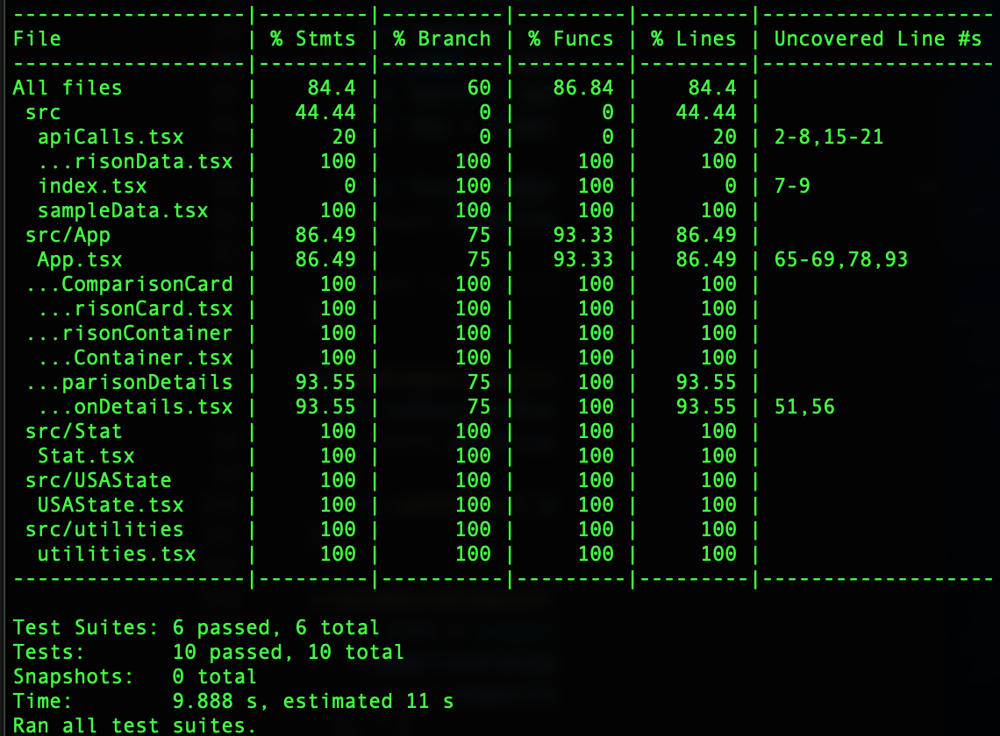

# [COVID Comparisons](https://codo-baggins.github.io/covid_comparisons/)

- Contributors: 
  - [Alyssa Bull](https://github.com/alyssabull)
  - [Joe Lopez](https://github.com/Codo-Baggins)
  - [Kara Caputo](https://github.com/kncaputo)

## Overview

- COVID Comparisons, or "COCO" for short, is an application that allows users to compare SARS-COV-19 statistics to other diseases and historical events.  The site is meant to bring some perspective to COVID-19's impact.  The various categories exist to give broader audiences something relatable that they may understand.  

## Tech Used

- TypeScript
- React
- Router
- Jest
- Sass

## Getting Started 

1. Fork the repo by clicking the "Fork" button in the top right corner of the page
2. Clone down your forked repo to your local machine by using the command `git clone git@github.com:Codo-Baggins/covid_comparisons.git` in your terminal
3. `cd` into the cloned down directory on your local machine 
4. Run `npm start` in the terminal 
5. Navigate to the localhost url that is provided after running the last command
6. To view the suite, run `npm test` in the terminal 

## How to Navigate

1. Upon arriving on the homepage, a user will be greeted with an overview of the number of COVID-19 
   cases, deaths, and hospitalizations in the entirety in the United States. 

   

2. Navigating further down the page, a user will see COVID-19 statistics for the state of Colorado and how that compares to the United States as a whole.

3. Scrolling to the bottom of the page, a user will see a dropdown menu containing various historical events and disease aftermath categories. A user should select a category and then click on the "View Comparison" button below the dropdown menu.

4. Subsequently, a user will be brought to a new page that compares statistical information for the selected topic to the mortality statistics of the state of Colorado.

   

5. Once a user has observed the comparison data, they are able to select different selections from the dropdown menu to view statistics for a different subject matter. 

6. Should a user desire to return home, they can click on the COCO logo at the top of the page and it will take them back to the home page.  

# Future Iterations

- A form for users to input their own comparison categories and data
- A clickable map of the United States to allow users to compare data from different states

## Project Goals

1. The main objective of this project was to gain a comprehensive understanding of TypeScript.
2. Reinforce the concepts of React, including the use of React Hooks and testing with Jest. 
3. Create an application that effectively conveyed the scale of COVID-19 and its impact.

## Project Evolution
- Initial goal was to achieve an MVP that included a home page with a quick overview of COVID-19 data for the United States and the state of Colorado
- In addition to a homepage, the MVP was to include a page with more detailed specifics about COVID-19 in the state of Colorado and how those details hold up when compared with statistics from other historical events
- We were able to achieve our MVP and then meet some additional stretch goals such as creating visual representations to help give a better perspective to visual learners 
- Overall, the project went well and we not only achieved what we wanted, we believe that refactoring that we did along the way set us up well for additional extensions in the future
- We were able to make a fully responsive app, incoperate Sass, and achieve over 93% test coverage on our functions.

   
